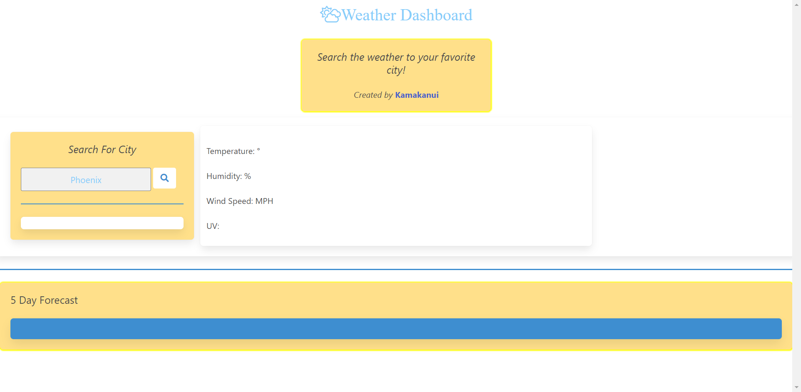

# Weather-Dashboard

## Description 

The Weather Dashboard is used to discover the current, and 5 day forecast of the city the user has entered.

## Usage 

Once one Weather-Dashboard

Click in Search Box.

Enter a city in search box previously mentioned.

Click the magnifiying glass button.

Once clicked the results will appear on the right of the search box and the 5 day bellow the search box.

The cities you onced searched will appear bellow the search box.

## Web Page Image

## Code Used

JavaScript
JSON
CSS
HTML
BULMA FRAMEWORK

## Contributing + Credits

Fellow bootcamp atendee Marco Avila

## Created by:

Kamakanui'aha'ilono J Castaneda

